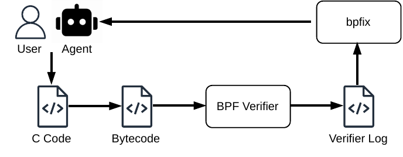

# BPFix: making eBPF verifier error more friendly 

**BPFix makes eBPF verifier errors feel closer to Rust compiler errors.**

The Linux eBPF verifier is powerful, but its failure logs are hard to read. 
BPFix is a userspace diagnostic tools for that problem. It reads verifier logs
from your existing workflow and turns them into explaination and point you to the error location where the verifier lost the proof.

## Quick Start

Install `bpfix` and load the prebuilt verifier failure:

```bash
cargo install --path crates/bpfix
sudo bpftool -d prog load examples/bpftool/quick-start.bpf.o /sys/fs/bpf/bpfix-demo 2>&1 | tee verifier.log
```

The command loads a real verifier failure from `bpfix-empirical`
(`stackoverflow-53136145`). The source parses either IPv4 or IPv6, derives a
UDP header pointer on each branch, checks the UDP header against `data_end`, and
then reads the destination port:

```c
if (ethertype == ETH_P_IP) {
    ipv4_hdr = (void *)eth + ETH_HLEN;
    if ((void *)(ipv4_hdr + 1) > data_end)
        return 1;
} else if (ethertype == ETH_P_IPV6) {
    ipv6_hdr = (void *)eth + ETH_HLEN;
    if ((void *)(ipv6_hdr + 1) > data_end)
        return 1;
} else {
    return 2;
}

if (ipv4_hdr)
    udph = (void *)ipv4_hdr + sizeof(*ipv4_hdr);
else
    udph = (void *)ipv6_hdr + sizeof(*ipv6_hdr);

if (udph + sizeof(struct udphdr) > data_end)
    return 1;

dst_port = __constant_ntohs(((struct udphdr *)udph)->dest);
```

That source shape is normal BPF C: the developer made the packet proof explicit.
The failure is in the verifier-visible proof lifecycle. One replay path reaches
the shared `udph->dest` load with `r5` as a scalar instead of a packet pointer:

```text
from 31 to 34: ... R5_w=40 ...
; if (udph + sizeof(struct udphdr) > data_end) @ prog.c:267
34: (bf) r3 = r5                      ; R3_w=40 R5_w=40
35: (07) r3 += 8                      ; R3=48
36: (2d) if r3 > r2 goto pc+4         ; R2=pkt_end() R3=48
; dst_port = __constant_ntohs(((struct udphdr *)udph)->dest); @ prog.c:270
37: (69) r2 = *(u16 *)(r5 +2)
R5 invalid mem access 'scalar'
```

```bash
bpfix verifier.log
```

The raw log says where the verifier stopped, but not the source-level proof
story. BPFix turns the trace into a Rust-style multi-span diagnostic:

```text
error[BPFIX-E006]: verifier-visible compiler lowering hides the required proof
  = class: lowering_artifact
  = confidence: medium
  = diagnostic: supported, help: repair_hint, span: exact_pc
  = next action: provenance
  --> prog.c:270
   |
263 | if (ipv4_hdr)
    | ------------- nearby source context for pointer provenance
267 | if (udph + sizeof(struct udphdr) > data_end)
    | -------------------------------------------- verifier state changes from pkt to scalar before the rejected access
270 | dst_port = __constant_ntohs(((struct udphdr *)udph)->dest);
    | ^^^^^^^^^^^^^^^^^^^^^^^^^^^^^^^^^^^^^^^^^^^^^^^^^^^^^^^^^^^ rejected here: verifier sees a scalar where a pointer is required
   |
   = verifier[229]: R5 invalid mem access 'scalar'
   = note: nearest BPF instruction pc 37
   = note: parsed 60 verifier state snapshots
   = note[lowering]: compiler-lowered control flow hides an established packet-pointer proof
   = required proof: preserve a verifier-recognized pointer type at the operation that requires a pointer
help: Reacquire a verifier-tracked pointer before the rejected dereference.
help: Use the packet pointer that received the data_end proof, or rederive and recheck it before the load.
help: Keep the final access on a verifier-tracked pointer; rederive it from a checked base after scalar work.
```

This is the kind of failure that motivates the project: the program is not
missing a generic "add a bounds check" hint. The useful answer is the proof
lifecycle: where a verifier-recognized pointer proof exists, where branch-local
provenance can be merged away, and where the rejected instruction finally needs
that proof.



The example object is copied from
`bpfix-empirical/cases/stackoverflow-53136145/prog.o`; replace it with the
object you are debugging in your own project.

The CLI shape is intentionally small:

```text
bpfix [OPTIONS] [LOG]
```

`LOG` can be a verifier, build, `bpftool`, libbpf, Aya, or BCC log. When `LOG`
is omitted or `-`, BPFix reads stdin. Positional input and stdin are always log
text. BPFix does not execute loader commands in the default path, and there is
no default command-execution workflow. Empirical corpus YAML and Docker-based execution
are explicit non-default modes; if Docker support is added, it should be selected
with an option such as `--docker`, not inferred from `LOG`. The output is always
plain text.

## Best Workflow

The best user experience is to keep your current BPF workflow and let BPFix
explain the verifier log it already produces:

```bash
make load 2>&1 | tee verifier.log
bpfix verifier.log
```

or:

```bash
sudo bpftool -d prog load examples/bpftool/quick-start.bpf.o /sys/fs/bpf/bpfix-demo 2>&1 | tee verifier.log
bpfix verifier.log
```

with feature-gated object metadata, after installing with `--features
object-analysis`:

```bash
bpfix --object examples/bpftool/quick-start.bpf.o verifier.log
```

BPFix does not need `case.yaml` for normal use. Empirical corpus YAML records are
evaluation fixtures; use the evaluation scripts when measuring the bundled
corpus.

The full user workflow is documented in `docs/user-guide.md`. More copyable
integration snippets live in `examples/`.

## Project Status

The maintained implementation is the Rust workspace:

```text
crates/
  bpfix/        command-line diagnostic tool
  bpfanalysis/  verifier-log and BPF bytecode analysis primitives
```

The earlier Python version has been removed from the maintained tree. Python
scripts that remain under `bpfix-empirical/tools/` are empirical replay and corpus
maintenance helpers, not a second BPFix implementation and not part of the
public CLI.

The public CLI design lives in `docs/open-source-tool-design.md`, and the full
user workflow is in `docs/user-guide.md`. Evaluation methodology and
project planning notes live under `docs/evaluation/` and
`docs/project-status.md`; they are supporting material, not required reading for
normal use.

`bpfix-bench/` contains the frozen BPFix-Bench main75 LLM repair benchmark. It
is a source-first benchmark: a repair succeeds only when the candidate BPF C
file compiles, loads through the kernel verifier, and passes the case oracle.
Start with `bpfix-bench/README.md` for the benchmark contract and
`docs/evaluation/bpfix-bench-llm-repair-eval.md` for the reported raw-log versus
BPFix-diagnostic results.

The default `bpfix` CLI uses the verifier-log parser from `bpfanalysis`.
Object/CFG analysis is behind the `object-analysis` Cargo feature; that path
uses `libbpf-sys` and the `vendor/libbpf` submodule for BPF instruction and
program-type constants.

The current user-facing pipeline is log-first: `bpfix` parses verifier state
snapshots, instantiates the required verifier proof from the terminal error
and verifier state, extracts proof lifecycle events, and maps them back to
source comments when the log contains BTF/source annotations. Packet bounds,
scalar range, nullable pointer, stack readability, reference lifecycle, helper
capability, and pointer-provenance failures now produce parameterized proof
requirements instead of only terminal-error categories. When built with
`--features object-analysis`, the CLI accepts `--object prog.o`, builds
`ProgramCFG` summaries, and correlates verifier-state PCs with CFG sites when
the object section layout matches the loaded verifier program. Full BTF source
correlation is the next analysis layer, not a runtime requirement for the basic
CLI.

## What BPFix Handles

Current diagnostics focus on common verifier failures:

- packet bounds checks
- nullable map value pointers
- uninitialized stack reads
- reference lifetime leaks
- scalar range and variable-offset problems
- pointer type/provenance loss
- verifier-visible compiler lowering artifacts
- verifier precision limits and likely false positives
- verifier complexity and loop limits
- missing kernel/helper/program-type support
- dynptr lifetime and bounds issues

## Non-Goals

BPFix is not:

- a kernel patch
- a verifier replacement
- an automatic source-code repair tool
- a semantic correctness checker for accepted BPF programs

It explains why the verifier rejected a program and what proof the developer
probably needs to make explicit.

## Development

Run tests:

```bash
cargo test --workspace
```

Check the workspace:

```bash
cargo check --workspace
```

Run the same lint gate used by CI:

```bash
cargo clippy --workspace --all-targets --all-features -- -D warnings
```

Format code:

```bash
cargo fmt --all
```

Run a smoke test:

```bash
cargo run -p bpfix -- bpfix-empirical/cases/stackoverflow-60053570/replay-verifier.log
```

Check release packaging:

```bash
make release-check
```

This runs packaging checks, example consistency checks, the empirical corpus
`--reject-fallback` gate, and the feature-gated object-analysis CLI tests.

`bpfix` depends on the sibling `bpfanalysis` crate. Publish `bpfanalysis` first,
wait for it to appear in the crates.io index, then publish `bpfix`.

## Repository Layout

```text
bpfix-empirical/       replayable verifier-failure corpus and raw examples
crates/bpfanalysis Rust analysis library
crates/bpfix       user-facing CLI
docs/project-status.md project planning and evaluation notes
docs/user-guide.md    install, getting logs, output, and CI usage
docs/open-source-tool-design.md public CLI contract
examples/          bpftool, libbpf, Aya, BCC, CI, and editor integration snippets
docs/evaluation/   evaluation and metric notes
bpfix-empirical/tools/ empirical replay and corpus-maintenance tools
vendor/libbpf/     libbpf submodule
```
